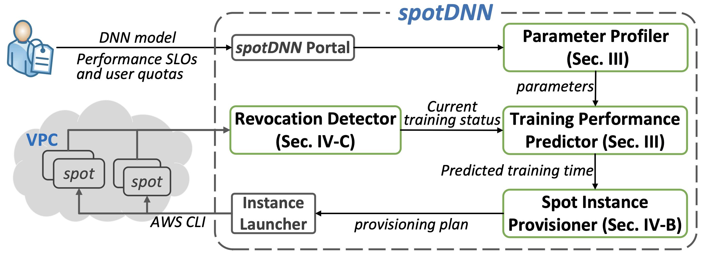

# *spotDNN*: Provisioning Spot Instances for Predictable Distributed DNN Training in the Cloud

 *spotDNN* is a heterogeneity-aware spot instance provisioning framework to provide predictable performance for DDNN training workloads in the cloud.

## Prototype of *spotDNN*

*spotDNN* comprises four pieces of modules: a parameter profiler, a training performance predictor, a spot instance provisioner and a revocation detector. Users first submit a DDNN training workload, the performance SLOs and the quotas to the *spot*DNN portal. When the parameter profiler finishes the profiling jobs, the performance predictor then predicts the DDNN training time using our performance model. To guarantee the target DDNN training time and training loss, the spot resource provisioner further identifies the cost-efficient resource provisioning plan using spot instances. Once the cost-efficient resource provisioning plan is determined, the instance launcher finally requests the corresponding instances in the plan using the command-line tools (e.g., AWS CLI) and places them in the same VPC. 



## Modeling DDNN Training Performance in Heterogeneus Environments

We characterize the DDNN training process in a heterogeneous cluster with $j$ normalized iterations and each iteration requires the normalized iteration time $T_{norm}$.  The normalized iteration time $T_{norm}$ can be considered as the expectation of the iteration time of heterogeneous workers, which is formulated as


$$
T_{norm}=\frac{1}{\sum_{i \in \mathcal{N}} \frac{1}{T^i}}
$$


DDNN training loss converges faster as the normalized batch size $b_{norm}$ gets larger, and the convergence rate slows down as more workers $|\mathcal{N}|$are provisioned. Moreover, DDNN training loss is inversely proportional to the normalized iterations $j$. Accordingly, we empirically model the training loss in a heterogeneous cluster as


$$
f_{loss}\left(b_{norm }, \mathcal{N}, j\right)=\frac{\left(\gamma_2 \cdot b_{n o r m}+\gamma_3\right) \sqrt{|\mathcal{N}|}}{j+\gamma_1}+\gamma_4
$$


We proceed to model the normalized batch size $b_{norm}$, which can be defined as the amount of data trained in a cluster per unit time divided by the total number of cluster iterations per unit time. The amount of data trained per unit time in a cluster can be represented as the cluster training speed (i.e., $v$), and the total number of cluster iterations per unit time can be identified as the sum of the iterations per worker per unit time. Accordingly, we formulate the normalized batch size $b_{norm}$ as


$$
b_{norm}=v \cdot T_{norm}
$$


Each iteration of DDNN training can be split into two phases: gradient computation and parameter communication, which are generally processed in sequential for the ASP mechanism. The communication phase consists of the gradient aggregation through PCIe and the parameter communication through the network, which can be formulated as


$$
T_{c o m m}^i=\frac{2 \cdot S_{p a r m}}{B_{w k}^i}+\frac{2 \cdot g^i \cdot S_{\text {parm }}}{B_{p c i e}}
$$


The contention of PS network bandwidth only occurs during part of the communication phase, Accordingly, the available network bandwidth $B_wk^i$ for a worker $i$ as


$$
B_{w k}^i= \begin{cases}P \cdot \frac{B_{p s}}{|\mathcal{N}|}+(1-P) \cdot B_{r e q} & B_{r e q}>\frac{B_{p s}}{|\mathcal{N}|} \mid \\ B_{r e q} & B_{r e q}<\frac{B_{p s}}{|\mathcal{N}|}\end{cases}
$$


The objective is to minimize the monetary cost of provisioned spot instances, while guaranteeing the performance of DDNN training workloads. The optimization problem is formally defined as


$$
\begin{array}{ll}
\min _{\mathcal{N}} & C=T \cdot \sum_{k \in m} n_k \cdot p_k \\
\text { s.t. } & f_{loss}\left(b_{norm}, \mathcal{N}, j\right)=L_{o b j}, \\
& T \leq T_{obj}, \\
& n_k \leq Lim_{k}, \quad \forall k \in m, n_k \in \mathcal{Z}
\end{array}
$$

## Getting Started

#### Requirements

1. TensorFlow 1.15.0

2. Python 3.7.13 ( including packages of numpy, pandas, scipy, subprocess, json, time, datetime )

3. Amazon AWS CLI

#### Setting up AWS

*SpotDNN* is integrated on Amazon AWS. To using *SpotDNN*, an AWS account is required. The following sections break down the steps to setup up the required AWS components.

#####  Setting up the AWS Access Key

First, setup an `AWS Access Key` for your AWS account. More details about setting up an access key can be found at [AWS Security Blog: Where's My Secret Access Key](https://aws.amazon.com/blogs/security/wheres-my-secret-access-key/). Please remember the values for the `AWS Access Key ID` and the `AWS Secret Access Key`. These values are needed to configure the Amazon AWS CLI.

#####  Configure the Amazon AWS CLI

1. Download and install the Amazon AWS CLI. More details can be found at [Installing or updating the latest version of the AWS CLI](https://docs.aws.amazon.com/cli/latest/userguide/getting-started-install.html). 
1. Configure Amazon AWS CLI by running command `aws configure`, if it is not yet configured.
2. Enter the following:
   - `AWS Access Key ID`
   - `AWS Secret Access Key`
   - Default region name
   - Default output format

##### Configure the Amazon VPC

1. Create a  VPC by specifying the IPv4 CIDR block and remember the value of the `VPC ID`.
2. Create a  subnet by specifying the `VPC ID` and remember the values of the `Route table ID` and `Subnet Id` returned.
3. Create a Internet gate and attached it to the VPC created before. Remember the value of the `Internet gateway ID`.
3. Edit the route table. Enter `0.0.0.0/0` to the `Destination` and `Internet gateway ID` to the `Target`.

## Installation

```shell
$ git clone https://github.com/spotDNN/spotDNN.git
$ cd spotDNN
$ python3 -m pip install --upgrade pip
$ pip install -r requirements.txt
```

## Run the Prototype System

1. First, provide the path of the model, the part 1 and the part 2 parameters in `profiler/instanceinfo.py` using for the DDNN training.

2. Then, profile the *workload-specific* parameters:

   ```shell
   $ cd spotDNN/profiler
   $ python3 profiler.py
   ```

​	*We have provide the *workload-specific* parameters of ResNet-110 model in `profiler/instanceinfo.py`. You can test the prototype system **without this step**.

3. Finally, define the objective loss `objloss` and objective training time `objtime` in `portal.py` and launch the prototype system:

   ```shell
   $ cd spotDNN
   $ python3 portal.py
   ```

After you run the script, you will get the training cluster information  in `spotDNN/launcher/instancesInfo` which is a *.txt* file, and the training results in `spotDNN/launcher/result`, which contains files copied from different instances. 

